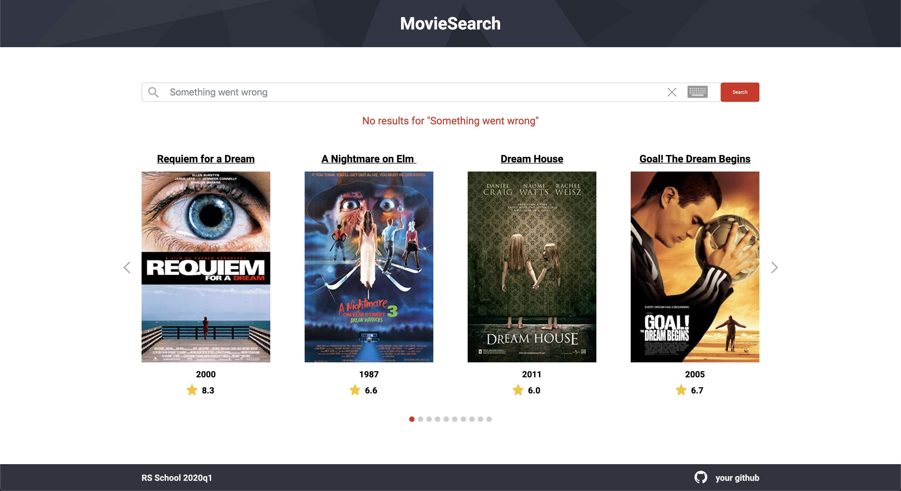

# MovieSearch

| Deadline         | Folder name | Branch name |
| ---------------- | ----------- | ----------- |
| 10.05.2020 23:59 | movie-search    | movie-search    |

1. Task : https://github.com/rolling-scopes-school/tasks/blob/master/tasks/movie-search.md
2. Screen: https://imgur.com/a/sEnwoZc
3. Completed task: https://romanenkoandrew-movie-search.netlify.app/
4. 10.05.2020 / 10.05.2020
5. Максимальный балл: 220 баллов
6. Оценка: 160 баллов

**MovieSearch** - одностраничное приложение, отображающее информацию о фильмах по запросу пользователя.  
Для получения информации используется OMDb RESTful API.

## Структура приложения
- header
- поле поиска
- карточки с информацией о фильмах
- footer

## Макет приложения:

## Работа приложения

- когда пользователь открывает приложение, на странице отображается поле поиска и карточки с информацией о фильмах по произвольному, указанному разработчиком запросу
- поиск осуществляется по полному названию фильма или по части названия
- если пользователь вводит корректный поисковый запрос, по которому API возвращает результат, информация на карточках с фильмами обновляется
- при выполнении поискового запроса происходит загрузка первой страницы результата поиска из API
- во время выполнения запроса на поиск на странице присутствует индикация процесса загрузки.

- количество отображаемых карточек подстраивается под ширину страницы (карточек может быть от 1 до 4)
- на каждой карточке отображается следующая информация о фильме: название, постер, дата выхода, рейтинг IMDb. 
- карточки можно перелистывать, для этого используется слайдер/свайпер (для его добавления может использоваться библиотека).
- при достижении конца слайдера/свайпера происходит загрузка следующей страницы результата поиска из API, если еще имеются данные для загрузки по данному поисковому запросу
  - пагинация работает по принципу бесконечного скроллинга, т.е. пролистывание слайдера/свайпера до тех пор, пока возможно загрузить дополнительные данные по текущему поисковому зарпросу без зацикливания слайдов
  - во избежание задержек в работе приложения, при наличии данных для загрузки, загрузку следующей страницы можно осуществлять, когда пользователю осталось пролистать определенное количество карточек
  - индикация текущего слайда в виде кружков или индикация текущей страницы не является обязательным
- если пользователь вводит некорректный поисковый запрос, по которому API возвращает ошибку, данные на карточках не меняются, приложение не ломается, выводится уведомление об ошибке

- возникающие ошибки в работе с API (прерывание соединения в ходе запроса, возвращаемые ошибки от API типа 4xx, 5xx) также обрабатываются клиентом и выводятся в область уведомления об ошибке

## Технические требования
- работа приложения проверяется в браузере Google Chrome последней версии
- можно использовать [bootstrap](https://getbootstrap.com/), [material design](https://material.io/), css фреймворки, html и css препроцессоры
- разрешается использовать jQuery только в качесте подключаемой зависимости для UI библиотек. Использование jQuery в основном коде приложения не допускается
- нельзя использовать Angular/React/Vue 

## Требования к оформлению приложения
- минимальная ширина, при которой приложение отображается корректно – 320 рх. На разрешениях меньше десктопного виртуальная клавиатура может скрываться.
- должны присутствовать все элементы пользовательского интерфейса, представленные в демо, однако сам предложенный дизайн приложения не является обязательным и в него можно вносить свои изменения с целью улучшения
- дизайн конечного приложения должен выглядеть целостно: внешний вид соответствуют приложению, которым будут пользоваться потенциальные пользователи, постеры фильмов имеют правильные пропорции (отсутствуют какие-либо искажения), все элементы пользовательского интерфейса функционируют исправно, разметка не разваливается при изменении разрешения
- позаботьтесь об интерактивности кликабельных элементов - изменение внешнего вида самого элемента и состояния курсора при наведении, использование разных стилей для активного и неактивного состояния элемента

## Критерии оценки:
**Максимальный балл за задание: 180 баллов при кросс-чеке / 220 баллов при проверке ментором**   

### Basic scope +60  
- [x] вёрстка. Минимальная ширина, при которой приложение отображается корректно – 320 рх. На разрешениях меньше десктопного виртуальная клавиатура может скрываться +10
- [x] дизайн, UI. Выполняются требования к оформлению приложения +10
- [x] поиск +20
  - [x] при открытии приложения курсор находится в поле ввода
  - [x] автозаполнение поля ввода отключено (нет выпадающего списка с предыдущими запросами)
  - [x] есть placeholder 
  - [x] поисковый запрос можно ввести как нажатием клавиши Enter, так и кликом по кнопке Search или аналогичной
  - [x] после ввода поискового запроса и отображения результатов поиска, набранный запрос отображается в поле ввода
  - [x] в поле ввода есть кнопка "Очистить", которая визуально представлена в виде крестика. При клике по кнопке "Очистить" поле ввода очищается 
- [x] при отправке запроса и ожидания ответа от сервера присутствует индикация процесса загрузки +10
- [x] при вводе в поле поиска корректного поискового запроса, по которому API возвращает результат, обновляются данные о фильмах +10

### Advanced scope +90/+130
- [x] при вводе некорректного запроса, по которому API возвращает ошибку, приложение не ломается, выводится уведомление "No results for … " +10
- [x] ошибки, возникающие во время выполнения запросов к API, обрабатываются и выводятся в область уведомления об ошибках +10
- [x] при вводе запроса на русском языке поисковый запрос переводится на английский язык, выводится уведомление "Showing results for … " +10
- [x] на карточке с фильмом указывается рейтинг IMDb +10
- [x] название фильма является ссылкой на видеогаллерею данного фильма на сайте `https://www.imdb.com` +10
- [x] реализован адаптивный слайдер/свайпер, карточки с фильмами можно перелистывать как кликами по стрелкам, так и пролистывать пальцем или мышкой +10
- [ ] при достижении конца слайдера/свайпера происходит загрузка следующей страницы поискового запроса +10
- [x] слайды меняются плавно, без рывков и без проскакиваний нескольких слайдов; при смене поискового запроса данные сначала загружаются, потом отображаются, плавная смена фонового изображения +10
- [x] карточки с фильмами отображаются на странице только после полной загрузки контента (нет постепенной подгрузки картинок) +10
- [ ] выполнены требования к коду (+40) (оценивает только ментор)
  - [ ] дублирование кода сведено к минимуму, не используются магические числа, строки, осмысленные имена переменных и функций, не слишком большие функции и т.д. (+10)
  - [x] js-код разбит на модули: (+10)
  - [x] подключены и используются webpack, eslint, eslint-config-airbnb-base, babel. Исправлены ошибки eslint (+10)
  - [ ] подключён jest, написаны 2-3 юнит-теста (+10)

### Hacker scope +30*
- [ ] реализован дополнительный, не предусмотренный заданием функционал. Дополнительный функционал оценивается с точки зрения его уместности и соответствия задачам приложения, сложности реализации, полезности для пользователя +10
- [ ] поисковый запрос можно набирать на виртуальной клавиатуре. Есть возможность переключения языка клавиатуры кликом мышки +10
- [ ] поисковый запрос можно отправить, кликая мышкой по кнопке Enter на виртуальной клавиатуре. Поисковый запрос  можно редактировать при помощи виртуальной клавиатуры перемещаясь стрелками вправо-влево и вводя текст на позицию курсора. +10*

## Штрафные баллы
- [ ] не выполняются требования к pull request, репозиторию, коммитам: -10 баллов (оценивает только ментор)
- [ ] присутствуют ошибки в консоли, связанные с исполняемым кодом (ошибки типа favicon.ico: Failed to load resource: the server responded with a status of 404 или ошибки, связанные с запросами к API, не учитываются) или предупреждения eslint-config-airbnb-base: -15 баллов (оценивает только ментор)

## Ключевые навыки

- использование RESTful API
- работа с асинхронными запросами
- реализация поиска

## Примеры использования API
- Получаем OMDb API Key    
`http://www.omdbapi.com/apikey.aspx`
- Поисковый запрос по ключевому слову "dream" (по умолчанию загружается первая страница)
`https://www.omdbapi.com/?s=dream&apikey=9b67fc54`
- Получение второй страницы для поискового запроса по ключевому слову "dream"
`https://www.omdbapi.com/?s=dream&page=2&apikey=9b67fc54`
- Получаем рейтинг IMDb по imdbID из предыдущего запроса  
`https://www.omdbapi.com/?i=tt0180093&apikey=9b67fc54`
- Получаем Yandex.Translate API key  
`https://translate.yandex.com/developers/keys`
- Перевод слова "мечта"  
`https://translate.yandex.net/api/v1.5/tr.json/translate?key=trnsl.1.1.20200322T155651Z.de98a60e6a99185e.089aea4237b51c6db082c966f27a7895cd1e8b44&text=мечта&lang=ru-en`
